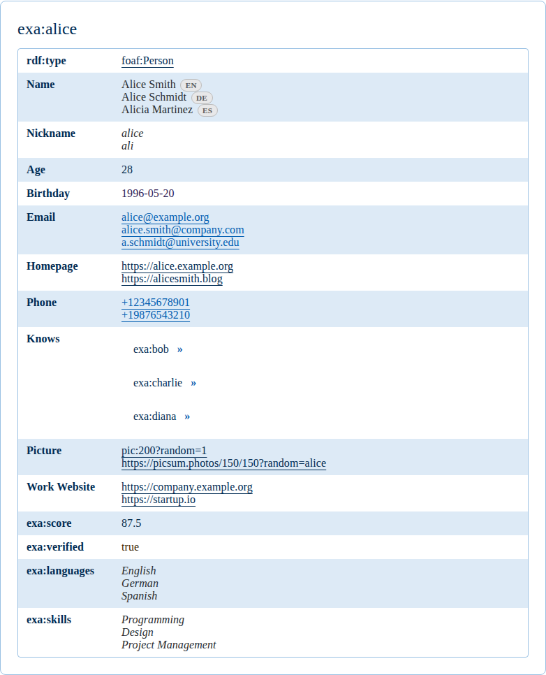
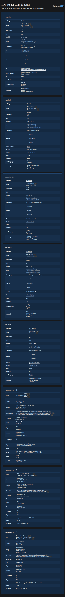

# RDF React Components

React components for rendering RDF data with a focus on structured, readable output.

## Install

```bash
bun add @sral/react-rdf-components
```

## Usage

```tsx
import "@digdir/designsystemet-css";
import { RdfDetailsView } from "@sral/react-rdf-components";

const data = `@prefix foaf: <http://xmlns.com/foaf/0.1/> .
<http://example.org/alice> a foaf:Person ; foaf:name "Alice" .`;

export function Example() {
  return <RdfDetailsView data={data} format="turtle" layout="table" />;
}
```

## Screenshots

Light:



Dark:



## Styles

This library renders Designsystemet React components. Import the Designsystemet CSS in your app and load a theme from `@digdir/designsystemet-css/theme` or a custom theme generated from Designsystemet tokens.

## RdfDetailsView Props

- `data` (string, required): RDF document content.
- `format` (string): `turtle`, `n-triples`, `n-quads`, `trig`, `json-ld`.
- `layout` (string): `table`.
- `showNamespaces` (boolean): Show namespace prefixes.
- `expandUris` (boolean): Expand prefixed URIs.
- `preferredLanguages` (string[]): Preferred label languages.
- `showDatatypes` (boolean): Show datatype annotations.
- `showLanguageTags` (boolean): Show language tags for literals.
- `theme` (string): `light` or `dark`.
- `showImagesInline` (boolean): Inline image rendering.
- `imagePredicates` (string[]): Predicate IRIs treated as images for inline previews.
- `showImageUrls` (boolean): Show image URLs below inline images.
- `predicateOrder` (string[]): Predicate IRIs to order first in the table layout.
- `vocabularies` (string[]): Vocabulary URLs to resolve human-friendly labels.
- `enableNavigation` (boolean): Allow navigating between subject nodes.
- `enableContentNegotiation` (boolean): Detect resource types (images, HTML, RDF).
- `literalRenderers` (Record<string, LiteralRenderer>): Map datatype IRI to custom literal renderers.
- `predicateRenderers` (Record<string, PredicateRenderer>): Map predicate IRI to custom object renderers.
- `className` (string): Wrapper class name.
